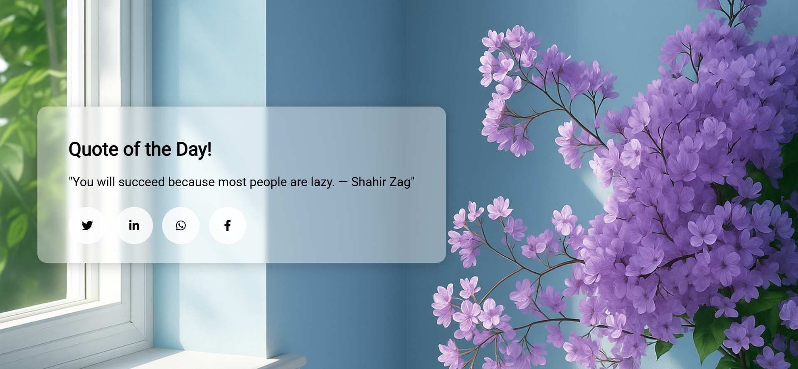

# 🌸 Daily Quote Generator – Python Flask Mini Project

A clean and elegant daily quote app that shares one motivational line each day.💬Simple design, soft transparent overlay and beautiful HD background for a calm experience.✨Easily share quotes across platforms with modern icon-only buttons.📲

The quote updates **automatically** each day — no refresh needed, no repeats. Just open, read and share.🐦

## 🚀 Features

- Displays a new quote every day 📅  
- Transparent text box over HD background ✨  
- One-click sharing via Twitter, WhatsApp, LinkedIn & Facebook 📲  
- Fully responsive and mobile-friendly 🌐  
- Works offline with your own custom quotes 💡  

## 🛠️ Tech Stack

- **Frontend**: HTML5, CSS3  
- **Backend**: Python (Flask)

## 📸 Screenshot

💬 *“Start your day with a quote that makes you think, act, or smile.”*
